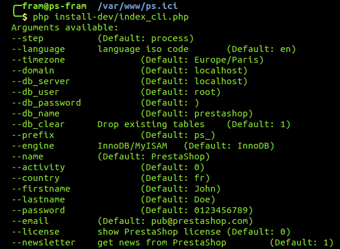
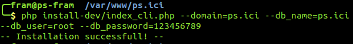

# PrestaShop installeren met het opdrachtregelscript

PrestaShop beschikt ook over een installatieprogramma voor opdrachtregelinstallaties. 

## Wat is het? <a id="PrestaShopinstallerenmethetopdrachtregelscript-Watishet?"></a>

Met dit speciale installatieprogramma kunt u PrestaShop installeren zonder tussenkomst van een webbrowser: plaats de inhoud van het .ZIP-archief op uw webserver en installeer PrestaShop via uw opdrachtregelinterface \(CLI\). U kunt alle CLI-software gebruiken mits u hiermee kunt communiceren met de opdrachten van de server: Bash, Windows PowerShell, OS X Terminal, PuTTY, etc.

Het doel van het hebben van een CLI-installatieprogramma naast het reguliere installatieprogramma in de browser is om deze optie te bieden voor geavanceerde gebruikers, die graag liever opdrachtregelinterfaces gebruiken zodat ze effectiever en nauwkeuriger een programma of besturingssysteem kunnen bedienen.

## Het gebruik <a id="PrestaShopinstallerenmethetopdrachtregelscript-Hetgebruik"></a>

Het CLI-installatieprogramma is eenvoudig te gebruiken: ga in de terminal naar de map `/install` \(of `/install-dev`\) \(dit betekent dat u beschikt over het bestand pestashop.zip\) en start het script met deze opdracht:

```text
$ php index_cli.php
```

Hier worden de verschillende beschikbare opties weergegeven.



Alle opties van het reguliere installatieprogramma in de browser zijn beschikbaar, waarbij de standaardwaarden worden vermeld. Bijna alle standaardwaarden kunnen hetzelfde blijven, want u kunt ze later nog bewerken via de PrestaShop-backoffice zodra de installatie is voltooid. Het e-mailadres en het wachtwoord zijn dezelfde als die zijn gebruikt om het backofficeaccount van de beheerder te maken...

Om aan de slag te gaan met de installatie hoeft u slechts één argument op te geven. In de realiteit moet u er meer opgeven:

* **domain**. De locatie waar u uw winkel wilt weergeven.
* **db\_server**. Het adres van de databaseserver.
* **db\_name**. De naam van de database die u wilt gebruiken.
* **db\_user**. De gebruikersnaam voor de database die u wilt gebruiken.
* **db\_password**. Het wachtwoord voor de bovenstaande gebruikersnaam.

Bijvoorbeeld:

```text
$ php index_cli.php --domain=example.com --db_server=sql.example.com --db_name=prestashop --db_user=root --db_password=123456789
```



Als u de waarde `--email` instelt op uw eigen adres, wordt er een samenvattingsmail naar u verstuurd zodra de installatie is voltooid.

## Lijst argumenten <a id="PrestaShopinstallerenmethetopdrachtregelscript-Lijstargumenten"></a>

Hier volgt de lijst argumenten voor index\_cli.php vanaf versie 1.6:

| **Naam** | **Standaardinstelling** | **Beschrijving** |
| :--- | :--- | :--- |
| --step | process |  |
| --language | en | ISO-code van de taal |
| --timezone | localhost |  |
| --domain | localhost |  |
| --db\_server | localhost |  |
| --db\_user | root |  |
| --db\_password | \(blank\) |  |
| --db\_name | prestashop |  |
| --db\_clear | 1 \(true\) | Bestaande tabellen verwijderen |
| --db\_create | 0 \(false\) | De database maken als er nog geen bestaat |
| --prefix | ps\_ |  |
| --engine | InnoDB | InnoDB/MyISAM |
| --name | PrestaShop | Naam van de winkel |
| --activity | 0 |  |
| --country | fr |  |
| --firstname | John |  |
| --lastname | Doe |  |
| --password | 0123456789 |  |
| --email | [pub@prestashop.com](mailto:pub@prestashop.com) |  |
| --license | 0 \(false\) | De PrestaShop-licentie weergeven |
| --newsletter | 1 \(true\) | De beheerder abonneren op de nieuwsbrief van PrestaShop |
| --send\_email | 1 \(true\) | Na de installatie een e-mail verzenden naar de beheerder |

