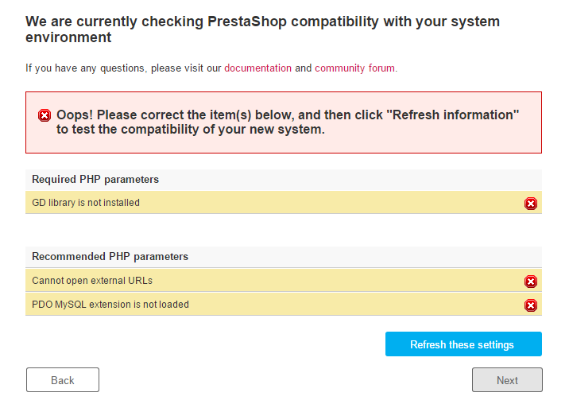

# PrestaShop installeren

* [PrestaShop installeren](prestashop-installeren.md#PrestaShopinstalleren-PrestaShopinstalleren)
  * [Verkorte installatie-instructies](prestashop-installeren.md#PrestaShopinstalleren-Verkorteinstallatie-instructies)
  * [Gedetailleerde instructies](prestashop-installeren.md#PrestaShopinstalleren-Gedetailleerdeinstructies)
    * [Het PrestaShop-archief downloaden en uitpakken](prestashop-installeren.md#PrestaShopinstalleren-HetPrestaShop-archiefdownloadenenuitpakken)
    * [PrestaShop uploaden](prestashop-installeren.md#PrestaShopinstalleren-PrestaShopuploaden)
    * [Een database maken voor uw winkel](prestashop-installeren.md#PrestaShopinstalleren-Eendatabasemakenvooruwwinkel)
    * [Het automatische-installatieprogramma starten](prestashop-installeren.md#PrestaShopinstalleren-Hetautomatische-installatieprogrammastarten)
    * [De installatie voltooien](prestashop-installeren.md#PrestaShopinstalleren-Deinstallatievoltooien)

Dit hoofdstuk is geschreven voor mensen die PrestaShop willen installeren op hun onlinewebserver.  
Als u PrestaShop op uw eigen computer wilt installeren, moet u eerst de instructies op deze pagina volgen: [PrestaShop op uw computer installeren](prestashop-computer-installeren.md).

Als u de instructies op die pagina al hebt gelezen, gaat u naar het gedeelte Een database maken voor uw winkel van deze pagina.

## PrestaShop installeren 

PrestaShop is eenvoudig te installeren. Wanneer alle bestanden op uw webserver staan, kunt u in de meeste gevallen binnen 5 minuten gaan configureren. Het installatieproces is zeer eenvoudig omdat het installatieprogramma alles voor u doet. Minder ervaren gebruikers hebben mogelijk tussen de 10 en 20 minuten nodig om het volledige proces te doorlopen.

Voordat u aan de slag gaat, controleert u of u over alle vereisten beschikt: serverruimte bij een hostingprovider, een domeinnaam, een FTP-client en een tekstverwerkingsprogramma. Zorg ervoor dat u eerst de instructies volgt op de pagina Wat u nodig hebt om aan de slag te gaan: [http://doc.prestashop.com/display/PS17/What+you+need+to+get+started](prestashop-installeren.md).

Onze webhostingpartner 1&1 IONOS biedt installatie met één klik zodat u tijd bespaart en u nog sneller aan de slag kunt. Hierdoor kan de installatietijd voor niet-ervaren gebruikers drastisch worden verkort. 

* [1&1 IONOS Hosting](http://www.tkqlhce.com/click-7873503-12490601-1380319321000) 

Deze webhosts maken vooral gebruik van de volgende scriptbibliotheken:

* [SimpleScripts](https://www.simplescripts.com/script_details/install:PrestaShop)
* [Installatron](http://installatron.com/apps?locale=en#cmd=browser&display=prestashop)
* [Softaculous](http://www.softaculous.com/apps/ecommerce/PrestaShop)

Sommige van deze scripts bieden zelfs ondersteuning voor bijwerken met één klik, en dat is zeer waardevol.

Andere hosts beschikken over hun eigen installatiescripts. Neem contact op met uw eigen host voor meer informatie

###  Verkorte installatie-instructies 

Hier volgt een korte reeks instructies voor personen die al bekend zijn met het installeren van PHP-/MySQL-toepassingen op een webserver. Als u het jammer vindt dat er te weinig details worden geboden, ziet u het volgende gedeelte van dit hoofdstuk voor meer details.

1. Download het PrestaShop-pakket en pak dit uit als u dit nog niet had gedaan.
2. Maak een database voor de PrestaShop-winkel op uw webserver als dit mogelijk is. Als er geen MySQL-gebruiker is met alle benodigde rechten voor het openen en bewerken van deze database, maakt u een dergelijke gebruiker aan.
3. Upload de drie PrestaShop-bestanden naar de gewenste locatie op uw webserver, waaronder het .ZIP-bestand \(dit bestand wordt later automatisch uitgepakt\).
4. Voer het PrestaShop-installatiescript uit door de openbare URL van de verkozen locatie in een webbrowser te openen. Dit is de URL waarnaar u de PrestaShop-bestanden hebt geüpload.
5. Volg de instructies in elk scherm van het installatieprogramma.
6. Wanneer de installatie is voltooid, verwijdert u de map `/install` en schrijft u de nieuwe naam van de map `/admin` op. Deze naam is uniek en speciaal voor u gemaakt. Dit is om veiligheidsredenen het geval.

PrestaShop is nu geïnstalleerd en kan worden geconfigureerd! Ga naar het hoofdstuk [Eerste stappen met PrestaShop 1.6](prestashop-installeren.md) van de gebruikershandleiding.

### Gedetailleerde instructies 

#### Het PrestaShop-archief downloaden en uitpakken 

U kunt de nieuwste versie van PrestaShop downloaden via [http://www.prestashop.com/nl/download](http://www.prestashop.com/en/download).

U hebt slechts één downloadoptie: de nieuwste stabiele versie die voor alle soorten webwinkels kan worden gebruikt.

Als u een van de voorgaande versies wilt downloaden, gaat u naar dit adres: [https://www.prestashop.com/nl/developers-versions\#previous-version](https://www.prestashop.com/en/developers-versions#previous-version).

Het wordt nooit aanbevolen om een andere versie te gebruiken dan de huidige, stabiele versie.

  
Klik op de knop Downloaden en sla het archief op op uw computer. U krijgt dan een bestand met de naam prestashop\_1.7.2.0.zip \(of vergelijkbaar, afhankelijk van het versienummer\).

Het gedownloade bestand is een .ZIP-archief. Om door te gaan met het proces **moet u het archief uitpakken**.

Als uw besturingssysteem geen ondersteuning biest voor .ZIP-bestanden, kunt u daar een programma voor downloaden en installeren, zoals:

* Windows:
  * 7-zip: [http://www.7-zip.org/](http://www.7-zip.org/)
  * WinZip: [http://www.winzip.com/win/en/index.htm](http://www.winzip.com/win/en/index.htm)
  * WinRAR: [http://www.rarlab.com/](http://www.rarlab.com/)
* Mac OS X:
  * iZip: [http://www.izip.com/](http://www.izip.com/)
  * WinZip Mac: [http://www.winzip.com/mac/](http://www.winzip.com/mac/)
  * Zipeg: [http://www.zipeg.com/](http://www.zipeg.com/)

  
Als u een van deze programma's gebruikt, wordt de inhoud van het archief uitgepakt naar een bekende locatie op uw harde schijf \(zoals op het bureaublad\). **Upload het .ZIP-bestand niet rechtstreeks naar uw webserver**.

Het .ZIP-archief beschikt over drie items in de hoofdmap:

* Het bestand prestashop.zip, dat alle PrestaShop-bestanden bevat die u binnenkort naar uw webserver gaat installeren.
* Het bestand Install\_PrestaShop.html, waarmee deze pagina in uw standaardbrowser wordt geopend.
* Het bestand index.php, waarmee de installatie wordt gestart.

Het bestand Install\_PrestaShop.html mag niet worden geüpload naar uw webserver.

#### PrestaShop uploaden 

U hebt nu een hostingruimte tot uw beschikking \(als dat niet het geval is, leest u het hoofdstuk Wat u nodig hebt om aan de slag te gaan in deze gids\), net als een map op uw harde schijf met het gecomprimeerde PrestaShop-archief.

Met deze stap gaat u de PrestaShop-bestanden uploaden naar uw hostingruimte. Dit doet u door uw computer te verbinden met uw server via een FTP-client. Deze hebt u als het goed is geïnstalleerd tijdens het lezen van het hoofdstuk Wat u nodig hebt om aan de slag te gaan. We maken gebruik van het gratis programma FileZilla \([http://filezilla-project.org/](http://filezilla-project.org/)\).

Maak via de FTP-client verbinding met uw hostingruimte; gebruik daarvoor de verbindingsgegevens die zijn opgegeven door uw webhost \(als u ze niet hebt, neemt u contact op met de host\). Wanneer u verbinding hebt gemaakt, kunt u de PrestaShop-bestanden van uw computer overzetten naar de server.

In FileZilla \(of een andere FTP-client\), bladert u door uw lokale mappen tot u de map hebt gevonden met de PrestaShop-bestanden. Laat deze map open in het gedeelte Lokale site aan de linkerkant.

In het gedeelte Externe locatie \(rechts\), bladert u naar de locatie waar u de PrestaShop openbaar beschikbaar wilt maken \(hoofdmap van het domein, submap, subdomein...\). Dit kan verschillen, afhankelijk van uw host en behoeften:

* Uw host:
  * Bij sommige hosts moet u mogelijk uw bestanden in een specifieke map plaatsen, zoals `/htdocs`, `/public_html`, `/web`, `/www`, `/`[uwdomeinnaam.com](http://yourdomainname.com/), etc.
  * Op de FTP-servers van andere hosts gaat u rechtstreeks naar het uploadgedeelte wanneer u zich aanmeldt.
* Uw behoeften:
  * Als u wilt dat de winkel de hoofdwebsite wordt voor uw domeinnaam \(zoals [http://www.voorbeeld.com](http://www.example.com/)\), upload u PrestaShop naar de hoofdmap van de uploadruimte \(afhankelijk van de host\).
  * Als u wilt dat de winkel in een submap van de domeinnaam komt te staan \([http://www.voorbeeld.com/shop](http://www.example.com/shop)\), moet u eerst een map maken via FileZilla \(klik met de rechtermuisknop en selecteer Map maken\). Upload daarna PrestaShop naar die map.
  * Als u wilt dat uw winkel in een subdomein van uw domeinnaam komt te staan \([http://shop.voorbeeld.com](http://shop.example.com/)\), moet u eerst een subdomein maken. Dit is afhankelijk van uw host: mogelijk kunt u dit doen door een nieuwe map toe te voegen in uw FTP-client, maar het kan ook zijn dat u het subdomein moet maken via het beheerdeelvenster van uw host. Lees voor informatie hierover de ondersteuningsdocumentatie van uw host. Na het aanmaken bladert u naar de map van het subdomein en upload u PrestaShop daar.

Aan de linkerkant van FileZilla staat nu de lokale map met de PrestaShop-bestanden uit het .ZIP-archief. Aan de rechterkant staat de bestemmingslocatie. Als u dit nog nooit hebt gedaan, hoeft u zich geen zorgen te maken. Het uploaden is eenvoudig: selecteer de drie bestanden uit de lokale map \(gebruik CTRL + A\) en sleep ze naar de map rechts. U kunt ook met de rechtermuisknop op de selectie klikken en Uploaden selecteren in het contextmenu.

#### Een database maken voor uw winkel 

Voordat u PrestaShop daadwerkelijk kunt installeren, moet u ervoor zorgen dat uw MySQL-server beschikt over een database die geschikt is voor de PrestaShop-gegevens. Als u dat niet het geval is, moet u een dergelijke database maken.

U kunt een database maken met een willekeurige databasebeheertool. We gaan gebruikmaken van de gratis phpMyAdmin-tool \([http://www.phpmyadmin.net/](http://www.phpmyadmin.net/)\); deze wordt vooraf geïnstalleerd bij de meeste webhosts.

Sommige hosts laten klanten liever een grafisch bedieningspaneel gebruiken, zoals cPanel, Plesk of een zelfgemaakt paneel. Zorg ervoor dat u de documentatie van uw host leest die gaat over het werken met MySQL-databases en maak een database voor uw winkel door de opgegeven instructies te volgen.

  
Maak verbinding met phpMyAdmin met behulp van uw inloggegevens; deze worden door uw host aangeleverd. U zou toegang moeten kunnen verkrijgen via een standaard-URL die is gekoppeld aan uw domeinnaam of de domeinnaam van de host.

In de linkerkolom ziet u de databases die momenteel beschikbaar zijn op uw MySQL-server. Enkele hiervan moeten met rust worden gelaten omdat ze worden gebruikt door phpMyAdmin of de host: `phpmyadmin`, `mysql`, `information_schema`, `performance_schema` en andere. Lees de documentatie van uw host om te weten te komen of een van deze databases als standaarddatabase kan worden gebruikt.

U kunt een gloednieuwe database maken door naar het tabblad Database te gaan en daar het formulier in het midden te gebruiken met de naam Nieuwe database maken. Voer een unieke naam in en klik op Maken. De naam van de database wordt toegevoegd aan de lijst links. U kunt de database nu gebruiken voor het opslaan van de PrestaShop-gegevens.

#### Het automatische-installatieprogramma starten 

Nu komt hetgeen waar alles om draait: PrestaShop installeren.

Het installatieproces is vrij eenvoudig, omdat het automatische-installatieprogramma van PrestaShop het meeste voor u regelt. U zou binnen enkele minuten door PrestaShop moeten kunnen bladeren. Zorg ervoor dat u alle pagina's zorgvuldig leest om geen informatie over het hoofd te zien.

Om het installatieprogramma te starten, bladert u naar de locatie van PrestaShop op uw webserver: het script detecteert automatisch dat PrestaShop nog niet is geïnstalleerd en opent vervolgens het automatische-installatieprogramma. Tegelijkertijd wordt het bestand prestashop.zip uitgepakt dat u hebt geüpload. Nu zijn alle PrestaShop-bestanden beschikbaar op uw webserver.

Als u een installatie uitvoert op uw eigen computer, moet u dit doen in de PrestaShop-map op uw lokale webserver. Deze is beschikbaar via [http://127.0.0.1/prestashop](http://127.0.0.1/prestashop).

Van daaruit hoeft u alleen maar te lezen en klikken en enkele formulieren in te vullen.

Er zijn zes stappen. Boven aan de pagina biedt de installatiehulp u inzicht in waar u zich in het proces bevindt: de grijze cirkels veranderen in groene vinkjes naar mate meer stappen worden voltooid.

**Stap 1: Welkomstpagina**

Deze pagina bevat een korte inleiding over het installatieproces. U kunt kiezen in welke taal de instructies van het installatieprogramma worden weergegeven.

U ontvangt ook een koppeling naar de documentatiesite \([http://doc.prestashop.com/](http://doc.prestashop.com/)\) en een link naar onze ondersteuningsaanbieding. U vindt via het volgende adres meer informatie over onze ondersteuningsservice: [https://addons.prestashop.com/nl/388-support](http://support.prestashop.com/en/).

Selecteer de taal waarin u het installatieprogramma wilt weergeven en klik op Volgende. Hiermee wordt ook de standaardtaal voor uw PrestaShop-installatie ingesteld, maar u kunt later ook andere talen inschakelen.

**Stap 2: De licenties van PrestaShop**

De tweede pagina is een eenvoudige vereiste: PrestaShop is gratis en wordt gedistribueerd met een bepaalde set open-source licenties. U mag de software niet gebruiken als u niet akkoord gaat met de licentievoorwaarden. In deze stap moet u de voorwaarden expliciet erkennen.

Lees de licenties van PrestaShop:

* _Open Software License 3.0_ voor PrestaShop zelf. U kunt er ook meer over lezen op [http://www.opensource.org/licenses/OSL-3.0](http://www.opensource.org/licenses/OSL-3.0). 
* _Academic Free License 3.0_ voor de modules en thema's. U kunt er ook meer over lezen op [http://opensource.org/licenses/AFL-3.0](http://opensource.org/licenses/AFL-3.0).

U moet akkoord gaan met beide licenties om PrestaShop te kunnen installeren.

Om de volgende stap te kunnen openen, moet u het selectievakje bij Ik ga akkoord met de bovenstaande voorwaarden selecteren. Klik daarna op Volgende. Als u niet akkoord gaat met de licenties, mag u PrestaShop niet installeren. U kunt dan ook niet op Volgende klikken.

**Stap 3 en 4: Systeemcompatibiliteit en winkelinformatie**

Op de derde pagina worden alle serverparameters op uw host snel gecontroleerd. In de meeste gevallen krijgt u deze pagina niet te zien, want als er geen fouten worden gevonden gaat u rechtstreeks naar de vierde pagina Winkelinformatie. Als dat het geval is, kunt u de derde pagina nog wel bekijken door op de koppeling Systeemcompatibiliteit te klikken in de linkerbalk.

Als er een fout optreedt tijdens de servercontrole uit de derde stap, wordt de pagina Systeemcompatibiliteit weergegeven; hier ziet u welke controles zijn mislukt.

**Systeemcompatibiliteit**

Op deze pagina wordt gecontroleerd of alles in orde is met uw serverconfiguratie: PHP-instellingen, machtigingen voor bestanden en mappen, tools van derden, etc.

Als er een fout optreedt, stopt het installatieprogramma hier zodat u de technische zaken kunt bekijken die moeten worden opgelost. U moet dan bijvoorbeeld de PHP-configuratie wijzigen of de bestandsmachtigingen bijwerken.

Hier volgt een lijst van de controles die worden uitgevoerd tijdens deze derde stap:

| **Controle** | **Hoe/waar oplossen?** |
| :--- | :--- |
| Is PHP 5.4 of nieuwer geïnstalleerd? | Webserver |
| Kan PrestaShop bestanden uploaden? | Het bestand php.ini \(`file_uploads`\) |
| Kan PrestaShop nieuwe bestanden en mappen maken? | Bestandsbrowser / FTP-client / opdrachtregel |
| Is de GD-bibliotheek geïnstalleerd? | php.ini file \(`extension=`[php\_gd2.so](http://php_gd2.so/)\) |
| Is de MySQL-ondersteuning ingeschakeld? | php.ini file \(`extension=`[php\_pdo\_mysql.so](http://php_pdo_mysql.so/)\) |
| Recursieve schrijfmachtiging voor ~/config/ | Bestandsbrowser / FTP-client / opdrachtregel |
| Recursieve schrijfmachtiging voor ~/cache/ | Bestandsbrowser / FTP-client / opdrachtregel |
| Recursieve schrijfmachtiging voor ~/log/ | Bestandsbrowser / FTP-client / opdrachtregel |
| Recursieve schrijfmachtiging voor ~/img/ | Bestandsbrowser / FTP-client / opdrachtregel |
| Recursieve schrijfmachtiging voor ~/mails/ | Bestandsbrowser / FTP-client / opdrachtregel |
| Recursieve schrijfmachtiging voor ~/modules/ | Bestandsbrowser / FTP-client / opdrachtregel |
| Recursieve schrijfmachtiging voor ~/override/ | Bestandsbrowser / FTP-client / opdrachtregel |
| Recursieve schrijfmachtiging voor ~/themes/default/lang/ | Bestandsbrowser / FTP-client / opdrachtregel |
| Recursieve schrijfmachtiging voor ~/themes/default/pdf/lang/ | Bestandsbrowser / FTP-client / opdrachtregel |
| Recursieve schrijfmachtiging voor ~/themes/default/cache/ | Bestandsbrowser / FTP-client / opdrachtregel |
| Recursieve schrijfmachtiging voor ~/translations/ | Bestandsbrowser / FTP-client / opdrachtregel |
| Recursieve schrijfmachtiging voor ~/upload/ | Bestandsbrowser / FTP-client / opdrachtregel |
| Recursieve schrijfmachtiging voor ~/download/ | Bestandsbrowser / FTP-client / opdrachtregel |
| Recursieve schrijfmachtiging voor ~/sitemap.xml | Bestandsbrowser / FTP-client / opdrachtregel |
| Kunnen via PrestaShop externe URL's worden geopend?  | [php.in](http://php.in/)-bestand \(`allow_url_fopen`\) |
| Is de optie voor wereldwijd registreren van PHP uitgeschakeld? | Het bestand php.ini \(`register_globals`\) |
| Is GZIP-compressie geactiveerd? | Het bestand .htaccess |
| Is de Mcrypt-extensie beschikbaar? | Het bestand php.ini \(zie [http://php.net/manual/en/mcrypt.setup.php](http://php.net/manual/en/mcrypt.setup.php)\) |
| Zijn de ‘magische aanhalingstekens’ van PHP gedeactiveerd? | Het bestand php.ini \(`magic_quotes_gpc`\) |
| Is de Dom-extensie geladen? | `--enable-dom` - tijdcompilatie-optie |
| Is de PDO MySQL-extensie geladen? | php.ini file \(`extension=`[php\_pdo\_mysql.so](http://php_pdo_mysql.so/)\) |

De PHP-configuratie kan slechts per geval worden gewijzigd, afhankelijk van uw toegangsniveau voor de server; daarom kan het proces alleen in volledige details worden beschreven. Het proces voor het bijwerken van bestandsmachtigingen is eenvoudiger uit te leggen.

Met machtigingen kent een bestandssysteem toegangsrechten toe aan specifieke gebruikers of gebruikersgroepen; deze krijgen dan bijvoorbeeld het recht om bestanden en mappen te bekijken of wijzigen. Het installatieprogramma moet enkele wijzigingen doorvoeren aan de bestanden die u hebt geüpload. Als het bestandssysteem geen toestemming geeft voor deze wijzigingen door onjuiste machtigingen, kan het installatieprogramma het proces niet voltooien.

Als in het installatieprogramma wordt weergegeven dat voor enkele bestanden of mappen niet de juiste machtigingen aanwezig zijn, moet u deze dus zelf wijzigen. Hiervoor moet u de bestanden openen op uw webserver en dus uw FTP-client gebruiken \(zoals FileZilla\) of de opdrachtregel.

Meld u aan bij uw serveraccount met uw FTP-client, blader naar de map van PrestaShop en zoek de mappen waarvoor volgens het installatieprogramma machtigingen moeten worden gewijzigd.

CHMOD

Het wijzigingen van de bestands-/mappenmachtigingen op een Unix-/Linux-systeem heet CHMOD, vernoemd naar de gelijknamige opdracht \(zie: [http://en.wikipedia.org/wiki/Chmod](http://en.wikipedia.org/wiki/Chmod). U vindt hier een uitleg over bestandsmachtigingen: [http://www.elated.com/articles/understanding-permissions/](http://www.elated.com/articles/understanding-permissions/)\).   
Het toekennen van schrijfmachtigingen voor bestanden of mappen heet het \(uitvoeren van\) een CHMOD 775.

Voor sommige hosts moet u CHMOD 777 gebruiken, maar het wordt niet aanbevolen deze opdracht te gebruiken, behalve in geval van nood.  
Als u CHMOD 777 moet gebruiken om PrestaShop te installeren, moet u overschakelen naar een veiligere instelling \(zoals 775 voor mappen en 664 voor bestanden\) na het voltooien van de installatie.  
Lees de documentatie van uw host zorgvuldig door.

  
Dankzij FileZilla \(en de meeste andere FTP-clients\), hoeft u geen Unix-opdrachten te gebruiken. Via de meeste FTP-clients kunt u de machtigingen eenvoudig en zichtbaar wijzigen: wanneer u een bestand of map hebt gevonden waarvoor een wijziging nodig is, klikt u er met de rechtermuisknop op en kiest u in het menu Bestandsmachtigingen... Er wordt dan een klein venster geopend.

Afhankelijk van uw serverconfiguratie \(die u niet altijd bij de hand hebt\), moet u zowel de kolommen Lezen als Uitvoeren selecteren en moet u in de kolom Schrijven ten minste de rijen Eigenaar en Groep selecteren. Voor sommige hosts kan het zijn dat u het selectievakje bij Schrijven \(openbaar\) moet inschakelen, maar wees daar voorzichtig mee: het is zelden een goed idee om iedereen op uw server wijzigingen te laten aanbrengen aan de inhoud van uw PrestaShop-installatie.

In sommige mappen moeten mogelijk ook voor alle bestanden en submappen de machtigingen worden gewijzigd. Schakel in dat geval het selectievakje bij Doorgeven aan submappen in.

Tijdens het wijzigingen van machtigingen in uw FTP-client moet u regelmatig controleren of u wel de juiste wijzigingen hebt doorgevoerd. Voer daarvoor de compatibiliteitscontroles van het installatieprogramma opnieuw uit: klik zo vaak als nodig op de knop Deze instellingen vernieuwen van het installatieprogramma.  
 Wanneer alle indicatoren groen zijn, klikt u op Volgende. Als ze niet allemaal groen worden, controleert u of in het installatieprogramma bovenaan het bericht ‘De PrestaShop-compatibiliteit met uw systeemomgeving is geverifieerd’ wordt weergegeven.

**Winkelinformatie**

Hier kunt u beginnen met het aanpassen van de winkel: geef deze een naam, geef aan wat de voornaamste activiteit is en geef persoonlijke gegevens op van de winkeleigenaar \(hiervoor gelden wetten in de meeste landen\)...

Gebruik geen dubbele punt in de naam van uw winkel; dit kan ertoe leiden dat sommige functies niet goed werken \(het verzenden van e-mails mislukt dan bijvoorbeeld\).

U kunt de dubbele punt vervangen door een streepje als u de naam uit twee onderdelen wilt laten bestaan. Gebruik bijvoorbeeld ‘MyStore - De beste plaats om inkopen te doen’ in plaats van MyStore: De beste plaats om inkopen te doen’.

In dit gedeelte kiest u ook het wachtwoord voor aanmelding bij het beheerdeelvenster van uw winkel. Kies een goed wachtwoord dat u kunt onthouden, maar dat ook goede veiligheid biedt!

Klik op Volgende om door te gaan.

**Stap 5: Systeemconfiguratie**

Deze pagina bevat een formulier waarmee u PrestaShop kunt laten weten waar de databaseserver zich bevindt en welke database moet worden gebruikt. U kunt daarnaast ook enkele andere gegevens opgeven. Al deze informatie moet worden opgegeven door uw webhost.

Vul in alle velden de databaseverbindingsinformatie in die is opgegeven door uw webhost:

* **Databaseserveradres**. De hostnaam van uw MySQL-server. Deze kan zijn gekoppeld aan uw domeinnaam \(zoals [http://sql.voorbeeld.com](http://sql.example.com/)\) of aan uw webhost \(zoals [http://mysql2.alwaysdata.com](http://mysql2.alwaysdata.com/)\), of kan gewoon een IP-adres zijn \(zoals 46.105.78.185\).
* **Databasenaam**. De naam van de database waarin u wilt dat PrestaShop gegevens opslaat. Dit is een bestaande database op uw MySQL-server, of de database die u hebt gemaakt met phpMyAdmin \(of een andere SQL-tool\) in het gedeelte Een database maken voor uw winkel van deze gids.
* **Database-aanmeldingsgegevens**. De naam van de MySQL-gebruiker die toegang heeft tot uw database.
* **Databasewachtwoord**. Het wachtwoord van de MySQL-gebruiker.
* **Database-engine**. De database-engine is de kern van uw databaseserver. InnoDB is de standaardengine en deze moet u gebruiken. Meer technologisch onderlegde mensen kunnen ook voor een andere engine kiezen. Over het algemeen hoeft de standaardinstelling niet te worden gewijzigd.
* **Tabellenvoorvoegsel**. Het voorvoegsel voor uw databasetabellen. `Ps_` is de standaardwaarde, waardoor de PrestaShop SQL-tabellen namen krijgen als `ps_cart` en `ps_customer`. Als u meer dan één exemplaar van PrestaShop in dezelfde database wilt installeren, moet u een ander voorvoegsel gebruiken voor elke installatie. We raden het echter aan om één database te maken per PrestaShop-installatie, als dit door uw webhost wordt toegestaan. Het is nóg beter om één installatie van PrestaShop uit te voeren en daarna de functie voor meerdere winkels in te schakelen om meerdere winkels te kunnen beheren via dezelfde PrestaShop-back-end.
* **Bestaande tabellen verwijderen**. Dit is alleen mogelijk in de modus voor ontwikkelaars. Bij het opnieuw installeren van PrestaShop kunt u ervoor kiezen om de bestaande PrestaShop-databasetabellen te verwijderen om een frisse start te maken.

Klik op de knop Test uw databaseverbinding nu! om te controleren of u de juiste serverinformatie hebt gebruikt.

Klik op Volgende: uw winkel wordt geconfigureerd, de databasetabellen worden gemaakt en ingevuld, etc. Dit kan enkele minuten duren. Wees geduldig en doe niets in de browser!

Het installatieprogramma doet het volgende:

* Het bestand `settings.inc.php` wordt gemaakt en uw instellingen worden toegepast.
* De databasetabellen worden gemaakt.
* De standaardwinkel wordt gemaakt met de standaardtalen.
* De databasetabellen worden ingevuld.
* De winkelinformatie wordt geconfigureerd.
* De standaardmodules worden geïnstalleerd.
* De demonstratiegegevens worden geïnstalleerd \(producten, categorieën, gebruikers, CMS-pagina's, etc.\).
* Het thema wordt geïnstalleerd.

Wanneer dit is gedaan, is uw winkel geïnstalleerd en kan deze worden geconfigureerd!

#### De installatie voltooien 

Zoals u aan de rechterkant van de laatste pagina van het installatieproces kunt lezen, zijn er verschillende laatste acties die moeten worden uitgevoerd voordat u het installatieprogramma kunt verlaten.

U kunt de beveiliging van uw installatie eenvoudig verbeteren door enkele belangrijke bestanden en mappen te verwijderen. Dit doet u via de FTP-client, rechtstreeks op de server. De items die u moet verwijderen, zijn:

* De map /install \(belangrijk\).
* De map /docs \(optioneel\), tenzij u de importeertool moet testen met de voorbeeld importeerbestanden die deze map bevat.
* Het bestand [README.md](http://readme.md/) \(optioneel\).

Klik op de knop Uw winkel beheren om naar het beheergedeelte te gaan.

U kunt de installatie ook beveiligen door een aangepaste naam te gebruiken voor de beheermap. Verander de naam ‘admin’ bijvoorbeeld naar 4dmin-1537 of MySecReT4dm1n.  
**** **Schrijf de nieuwe naam van de map admin op**, want van nu af aan opent u de beheerpagina's via dit adres!

Tot slot, om alle potentieel schadelijke ‘deuren’ te sluiten, gebruikt u de FTP-client om de machtigingen van de bestanden en mappen bij te werken naar 664 of 666 als uw host dit vereist. Als sommige modules niet werken door de beperkte toegangsrechten, kunt u de machtigingen weer instellen op 755.

**Gefeliciteerd! De installatie is voltooid.**

Meld u aan bij de PrestaShop-backoffice door naar uw zojuist hernoemde admin-map te gaan en begint met het vullen van uw catalogus met producten. Voeg informatie toe over de verzendkosten, voeg merken en leveranciers toe, wijzig het thema en configureer de vele instellingen zodat ze aansluiten op uw smaak en behoeften. Zie het hoofdstuk Eerste stappen met PrestaShop 1.7 van de gebruikershandleiding voor meer informatie: [https://app.gitbook.com/@prestashop/s/english-documentation-for-prestashop-1-7/user-guide/first-steps-with-prestashop-1.7](https://app.gitbook.com/@prestashop/s/english-documentation-for-prestashop-1-7/user-guide/first-steps-with-prestashop-1.7).

Maak regelmatig een back-up van uw database en bestanden, liefst op meer dan één computer, voor het geval er problemen optreden met uw hardware of beveiliging.

